# Sole Society 


Sole Society is an ecommerce website focusing on sneakers.

Sole Society provides users will the ability to purchase exclusive sneakers. Authenticated users can utilise the review and favourite features whilst store owners can access the CRUD functionality by adding editing publishing and deleting products to sell. 

A live version of the site is available [here](https://sole-society.herokuapp.com/)

## Table Of Contents 
1. [UX](#ux)
2. [User Stories](#user-stories)
3. [Stucture](#structure)
4. [Database Model](#database-model)
5. [Design](#design)
6. [Marketing](#marketing)
7. [Features](#features)
8. [Technology Used](#technologies-used)
9. [Testing](#testing)
10. [Bugs](#bugs)
11. [Deployment](#deployment)
12. [Finished Product](#finished-product)
13. [Credits](#credits)


### Strategy 

The purpose of this website was to provide users with an ecommerce store where they can purchase sneakers. Agile methodologies were utilised in order to create the website. 

#### Project Goals

The main goals of this project were: to create an ecommerce store which simple an intuitive to navigate, responsive in design, customers are offered the ability to register, display appealing products to customers, ensure the site is aesthetically relevant to the products being sold and create an easy shopping experience for all customers. 

### Epic 1 - Site Foundations 

* As a site user I can click navigation links so that I can navigate throughout the site
* As a site user I can receive messages for the actions performed on the website so that I am constantly aware of the actions I have performed
* As a site user I can click on social media links, including the facebook page, so that I can follow the stores social media presence
* As a site user I can sign up for a newsletter so that I am aware of the latest store news / products

### Epic 2 - Products

* As a site user I can see an overview of the product details whilst in list view so that I am aware of the product details before clicking on the product

* As a site user I can view individual product details so that I can see more in-depth details of products

* As a site user I can sort products by rating, gender or brand so that I can filter products to easily find a product I am searching for

* As a site user I can select the size of the product so that I can purchase the correct size

* As a site user I can select the quantity of the product ** so that I can purchase the correct quantity.

### Epic 3 - The bag 

* As a site user I can see an overview of the products I have in my bag so that I am aware of what products I am about to purchase

* As a site user I can I can to easily add items to my bag so that I can add extra products I would like to purchase before completing payment.

* As a site user I can see the price of my bag so that I am aware of the cost of my purchases

* As a site user I can I can add or delete items from my bag so that I can remove or change any items I do not want before checking out

* As a site user I can alter the size and quantity of the product so that I have the correct size and quantity before purchase.

### Epic 4 - The checkout 

* As a site user I can see an overview of my bag so that I can confirm I am happy with purchases before payment

* As a site user I can enter my payment details** so that I can purchase my items with relative ease.

* As a guest user I can enter my details without having to sign in** so that I can still make a purchase as a guest
*  As a logged in user my details are automatically entered so that I can avoid repetitive actions

* As a site user I can I am informed whether my purchase has gone through so that I know whether the purchase has been successful

### Epic 5 - Account registration 

* As a user I can sign up to become a registered account user so that I can access the sites registered users' functions

* As a registered user I can store my details so that I do not have to continually enter my details such as shipping

* As a registered user I can save items till later so that I can return later to purchase or remove items

* As a registered user I can view my order history so that I can see what items I have previous purchased

### Epic 6 - Reviews

* As a site user I can read reviews so that I can see what other users feel about purchased products

* As a registered user I can write reviews for products so that I can share my opinion on the products purchased

* As a registered user I can delete a review so that it can be removed if I no longer want it to be displayed

### Epic 7 - Store Owner 

* As a store owner I can add a product so that I can sell my product online

* As a store owner I can edit a product so that I can edit product details

* As a store owner I can I can delete a product so that I can remove the product from sales

### User Stories 

Throughout the project,  GitHub projects was utilised to track user stories in order to manage the project. When a user story was being focused on, it would be moved from the 'To Do' section to the 'In Progress' section. Once finished it would be moved to the 'Done' section. At the end of the project, any user stories which were not incorporated were moved to the 'Won't Have' section.


Initial user story project board
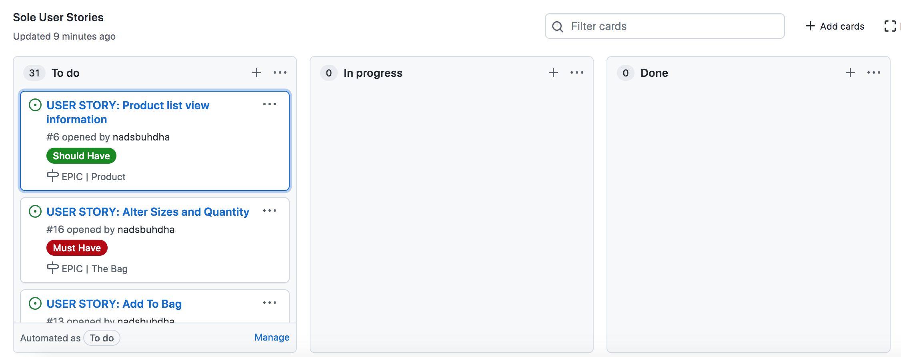

In Progress projectboard board
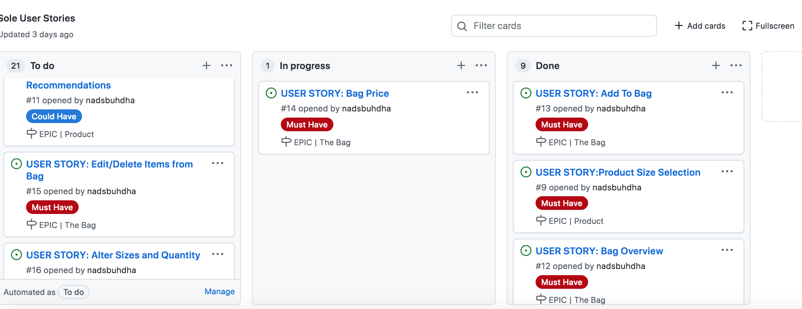

Finalised projectboard board
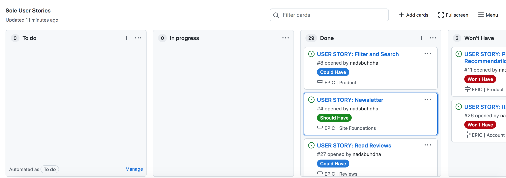


### Strategy Table 

In order to create a site which is relevant to its target audience, various other related website were researched first in order to comprehensively analyse the features which would be necessary.

| Feature        | Importance  | Viability  |
| ------------- |:-------------:| -----:|
| Responsive design | 5 | 5 |
| Product List View     | 5 | 5 |
| Product Detail View      | 5 | 5 |
| Product Sort     | 5 | 5 |
| Product Search     | 5 | 5 |
| Shopping Bag Overview     | 5 | 5 |
| Bag update notifcation      | 4 | 4 |
| Alter quantities of product in bag      | 4 | 4 |
| Order Summary in checkout     | 5 | 4 |
| Display purcahse total    | 5 | 5 |
| Payment system      | 5 | 5 |
| Feedback that order is complete     | 5 | 5 |
| View Reviews      | 3 | 3 |
| Write & Delete reviews      | 3 | 3 |
| User Registration     | 5 | 5 |
| Favourite Products      | 3 | 4 |
| User Newsletter subscription   | 4 | 4 |
| Create, Update, Delete products for superuser      | 5 | 5 |
| Reccomended products for registered user      | 1 | 1 |
| User Item Star Rating                         | 1 | 2 | 
| Total                                         |83 |  86 |
### Scope

The project was developed in multiple phases in order to build a minimum viable product. This product could then be developed and extended on. 

### Phase 1 

* Responsive design
* Product List View
* Product Detail View
* Product Sort
* Product Search
* Shopping Bag Overview
* Bag update notification
* Payment system
* Alter quantities of product in bag
* Order Summary in checkout
* Display purchase total 
* Feedback that order is complete
* User Registration
* Create, Update, Delete products for superuser


### Phase 2 
* View Reviews 
* Write & Delete reviews
* Favourite Products
* User Newsletter subscription


### Phase 3 
*  Reccomended products for registered user


## Structure 

It is imperative that users can navigate through the site easily and instinctively. In order to adhere to this the following considerations undertaken:

* Responsive design throughout the site. 
* Header, footer and navigation visable and consistant throughout entire site. 
* Clearly labelled links.
* Consistant font sizing and colouring throughout site. 


## Database Model

Planned Database Model: 


Final Database Model:

### Checkout model 

``` class Order(models.Model):
    """
    A model for the customer order
    """

    order_number = models.CharField(max_length=32, null=False, editable=False)
    user_profile = models.ForeignKey(UserProfile, on_delete=models.SET_NULL,
                                     null=True, blank=True, related_name='orders')
    full_name = models.CharField(max_length=50, null=False, blank=False)
    email = models.EmailField(max_length=254, null=False, blank=False)
    phone_number = models.CharField(max_length=20, null=False, blank=False)
    country = CountryField(blank_label="Country *", null=False, blank=False)
    postcode = models.CharField(max_length=20, null=True, blank=True)
    town_or_city = models.CharField(max_length=40, null=False, blank=False)
    street_address_1 = models.CharField(max_length=80, null=False, blank=False)
    street_address_2 = models.CharField(max_length=80, null=True, blank=True)
    county = models.CharField(max_length=80, null=True, blank=True)
    date = models.DateTimeField(auto_now=True)
    delivery_cost = models.DecimalField(max_digits=6, decimal_places=2, null=False, default=0)
    order_total = models.DecimalField(max_digits=10, decimal_places=2, null=False, default=0)
    grand_total = models.DecimalField( max_digits=10, decimal_places=2, null=False, default=0)
    original_bag = models.TextField(null=False, blank=False, default='')
    stripe_pid = models.CharField(max_length=254, null=False, blank=False, default='')


    def _generate_order_number(self):
        """ Generates a random, unique order number """
        return uuid.uuid4().hex.upper()


    def update_total(self):
        """
        Update the grand total each time a line item is added,
        accounting for delivery costs
        """
        self.order_total = self.lineitems.aggregate(
            Sum('lineitem_total'))['lineitem_total__sum'] or 0
        if self.order_total < settings.FREE_DELIVERY_THRESHOLD:
            self.delivery_cost = self.order_total * settings.STANDARD_DELIVERY_PERCENTAGE / 100
        else:
            self.delivery_cost = 0
        self.grand_total = self.order_total + self.delivery_cost
        self.save()


    def save(self, *args, **kwargs):
        """
        Orverride the original save method to set the order number
        if it hasn't already been set
        """
        if not self.order_number:
            self.order_number = self._generate_order_number()
        super().save(*args, **kwargs)

        
    def __str__(self):
        return self.order_number 
```


### Line Item Model 
```
class OrderLineItem(models.Model):
    order = models.ForeignKey(Order, null=False, blank=False, on_delete=models.CASCADE, related_name = 'lineitems')
    product = models.ForeignKey(Product, null=False, blank=False, on_delete=models.CASCADE)
    product_size = models.CharField(max_length=2, null=True, blank=True)
    quantity = models.IntegerField(null=False, blank=False, default=0)
    lineitem_total = models.DecimalField(max_digits=6, decimal_places=2, null=False, blank=False, editable = False)

    def save(self, *args, **kwargs):
        """
        Orverride the original save method to set the lineitem total
        and update the order total
        """
        self.lineitem_total = self.product.price * self.quantity
        super().save(*args, **kwargs)

    def __str__(self):
        return f'SKU {self.product.sku} on order {self.order.order_number}'
```

### Newsletter Model
```
class Newsletter(models.Model):
    """ A model for users to subscribe to a newsletter """

    email = models.EmailField(max_length=254, null=False, blank=False)
    date_added = models.DateTimeField(auto_now_add=True)

    def __str__(self):
        return self.email
```

### Category Model
```
class Category(models.Model):
    """
    The Category model class & friendly name
    """

    class Meta:
        verbose_name_plural = 'Categories'

    name = models.CharField(max_length=254)
    friendly_name = models.CharField(max_length=254, null=True, blank=True)

    def __str__(self):
        return self.name

    def get_friendly_name(self):
        return self.friendly_name
```

### Brand Model
```
class Brand(models.Model):
    """
    Brand Class
    """
    name = models.CharField(max_length=200)
    
    friendly_name = models.CharField(max_length=200)

    def __str__(self):
        return self.name
```

### Product Model
```
class Product(models.Model):
    category = models.ForeignKey('Category', null=True, blank=True, on_delete=models.SET_NULL)
    sku = models.CharField(max_length=254, null=True, blank=True)
    name = models.CharField(max_length=254)
    description = models.TextField()
    brand = models.ForeignKey('Brand', null=True, blank=True, on_delete=models.SET_NULL)
    gender = models.CharField(choices=GENDER, max_length=10,default='u')
    has_sizes = models.BooleanField(default=False, null=True, blank=True)
    price = models.DecimalField(max_digits=6, decimal_places=2)
    rating = models.DecimalField(max_digits=6, decimal_places=2, null=True, blank=True)
    image_url = models.URLField(max_length=1024, null=True, blank=True)
    image = models.ImageField(null=True, blank=True)
    

    def __str__(self):
        return self.name
```

### Review Model 
```
class Review(models.Model):
    """ The review model """
    product = models.ForeignKey(Product, on_delete=models.CASCADE, related_name='reviews')
    user = models.ForeignKey(User, null=True, on_delete=models.SET_NULL)
    review_body = models.TextField()
    created_on = models.DateTimeField(auto_now_add=True)

    class Meta:
        ordering =['created_on']
    
    def __str__(self):
        return f"Review {self.review_body} by {self.user}  "
```
### User Profile Model
```
class UserProfile(models.Model):
    """
    A user profile model for maintaining default
    delivery information and order history
    """
    user = models.OneToOneField(User, on_delete=models.CASCADE)
    default_phone_number = models.CharField(max_length=20, null=True, blank=True)
    default_country = CountryField(blank_label='Country', null=True, blank=True)
    default_postcode = models.CharField(max_length=20, null=True, blank=True)
    default_town_or_city = models.CharField(max_length=40, null=True, blank=True)
    default_street_address_1 = models.CharField(max_length=80, null=True, blank=True)
    default_street_address_2 = models.CharField(max_length=80, null=True, blank=True)
    default_county = models.CharField(max_length=80, null=True, blank=True)

    def __str__(self):
        return self.user.username


@receiver(post_save, sender=User)
def create_or_update_user_profile(sender, instance, created, **kwargs):
    """
    Create or update the user profile
    """
    if created:
        UserProfile.objects.create(user=instance)
    # Existing users: just save the profile
    instance.userprofile.save()
```
### Favourites Model 
```
class Favourites(models.Model):
    """
    A model that keeps track of users favourite items.
    """
    user = models.OneToOneField(
        User,
        on_delete=models.CASCADE
    )
    product = models.ManyToManyField(
        Product,
        blank=True
    )
```


## Design 

### Wireframes

Before building the site, Balsamiq was utilised to create wireframes of the site. Wireframes were created in order to develop the websites aesthetic and to give an impression of the responsive style across different platforms.

| Page        | Desktop  | Mobile version  |
| ------------- |:-------------:| -----:|
| Home Page | ||
| All Products |   |   |
| Product Details | |  |
| Shopping Bag |  |  |
| Checkout | |  |
| Order Summary |  |  | 
| Sign In | 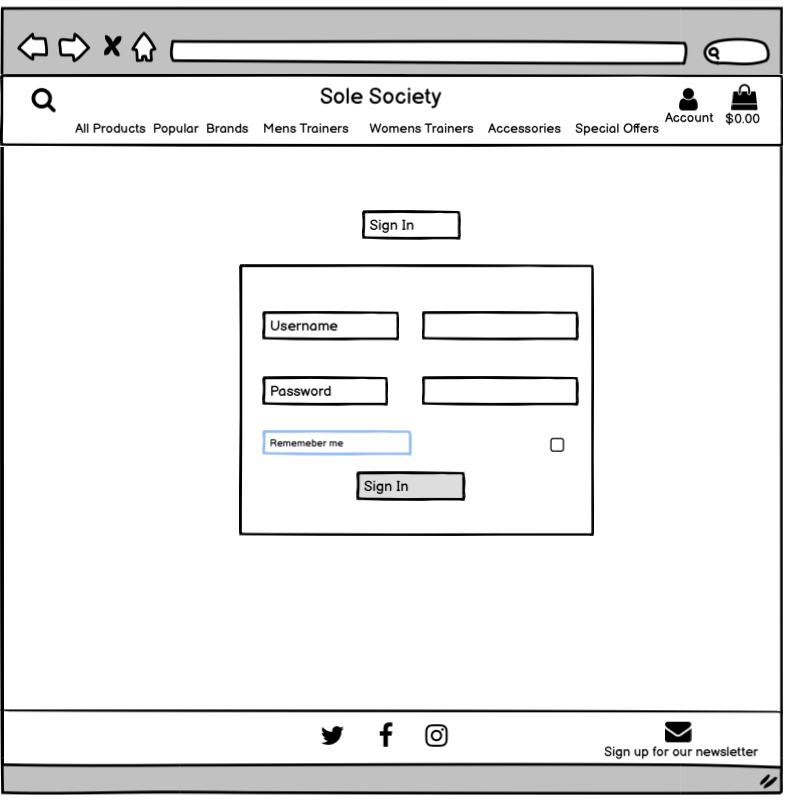 |  |
| Sign Up |   | |
|Sign Out |  | |
| User Profile |  |  |
|Adding Products as superuser | |   |
| Editing Products as superuser|||
| Admin Products View|  |  |


### Colour Schemes

During the design phase of building the site, various sneaker focuesed ecommerece stores were researched. Colours are used sparingly so I decided to adopt this neutral approach aesthetically. 

#FFFFFF white was used for the majority of the background and header. 
#212529  was used for buttons and product cards.
#080808 was used for the footer

### Fonts 

Nunito was used as the primary font across the site. After research into ecommerce fonts, Nunito was chosen for its well-balanced appearance and rounded asaesthetic, which compliments the rounded border radius which features across the site. San-serif was chosen as a backup font, should Nunito fail. 

## Marketing

### Business Model

### Company description
The Sole Society is a B2C retail company that sells branded footwear to consumers. The business generates revenue by selling footwear to customers and consumers. The Society does not sell original products but products from external branded wholesale retailers or brand manufacturers.
### Target Audience 
The core target market for the Sole Society is fashion-oriented individuals ranging in age from 12 – 40. 


### Marketing Strategy
Two specific web marketing strategies have been chosen for the Sole Society:  
Social Media Marketing 

A Facebook page has been created for the Sole Society. The facebook page can be viewed [here](https://www.facebook.com/people/The-Sole-Society/100084853331729/)

A variety of benefits are acquired with a Facebook marketing page including: 
* Brand awareness. 
* Driving traffic to the sole society website through Facebook links
* Targeted advertising which can be adhered to specific demographics
* Customer interaction through posted links generating communication between business and consumer

### Facebook 


Email Marketing.
Users can voluntarily sign up and subscribe to the site newsletter. Users can be kept up to date with the latest news and offers from the site via the emailed newsletter. 
Once a user is registered, their email is stored in the site database which can be accessed through the admin panel. Users are notified via the site when they have successfully subscribed to the newsletter. 


### Search Engine Optimisation

In order to improve the search engine optimisation of the site, research was conducted to search for relevant keywords to use in meta tags in the project head element. [Wordtracker](www.wordtracker.com) was utilised to find keywords that were high in volume, yet relatively low in competition to insert into the head of the site. A mixture of short and long tail keywords were selected. 

The selected keywords are:
* air maxes 
* sneakers 
* nike jordans 
* nike, snkrs 
* basketball shoe 
* nike shoes for women 
* white high top converse


## Features 

The entire website has been designed with a responsive mobile first approach.

The Header of the site features the site logo which links back to the homepage. The navigation links allow the shopper to navigate  and access differing sections across the website.


The header features a dropdown menu where users can navigate  to products filtered by the specific category they pick. 


When a user send an item to the bag, the bag on the header highlights and displays current bag price.


Users can search for specific products with the use of the searchbar. 


The homepage features a carousel of product images. The carousel features a button where users can navigate to all products.


The footer features on each page. Social media icons feature on the footer, including the facebook page. Users can also sign up to the newsletter. 


### Products Page 

The products page features all of the stores products in individual cards. Products can be filtered by Mens, Womens, Accessories & special offers. Products can be futher filtered by best sellers, exclusives, new arrivals, sport shoes and essentials. 
Products can also be sorted by price, rating, name, category and brand. 


The product card features the name of the product, the brand, the price,  rating for the product and the ability to favourite a product. 


### Product detail

The product detail page features The name of the product, a larger version of the product image, the  product brand, the price, the product rating and a short description of the product.
Users can favourite the product from here. 
User can select the size and quantity of the product from this page. 
Once size and quantity users can either add the product to the bag or continue to shop. 
Users can view reviews of the product and authenticated users can leave a review of a product. 


Reviews

### Bag page

If a user clicks on the bag page and there are no products in the bag then an empty bag message is displayed 


When a user has products in their bag, the product image, name, sku, price and quantity are displayed. Users can update the quantity of a product from the shopping bag. Users can also remove a product from the bag. The grand total, including the delivery fee (if there is one) is, also featured towards the bottom of the page. The proceed to checkout button or continue shopping buttons are also present. 


### Checkout Page

The checkout page features an overview of the products the user is intending to purchase. 
A form is present for the user to fill out in order to complete the purchase.
Included in the form is a section for users to input their card details. This is connected to stripe payments system. 
Under the payment form, a message is displayed informing the shopper the amount to be charged on the provided card.
Adjust bag and complete order buttons are featured so users can edit their order or complete their order


### Checkout Success 


The payment success page shows a summary of the users order, with an order number.
Users are notified of an email that will be sent to confirm their order. 


The payment system has been connected to a webhook to ensure payments succeed and products are sent. 


### My Profile 

User profile page features a form for users to store default delivery information as well as their order history. 
User profile also features the products the users has favourited. 


### Account Pages 

| Page        | Feature  | Image  |
| ------------- |:-------------:| -----:|
| Sign In | The sign in page allows users to sign in with their account details ||
| Sign Out | Users can sign out from this page||
| Sign Up | Unregistered users can sign up to the website here ||


### Product Management

| Page        | Feature  | Image  |
| ------------- |:-------------:| -----:|
| Add Products | This page allows users to add new products using the form |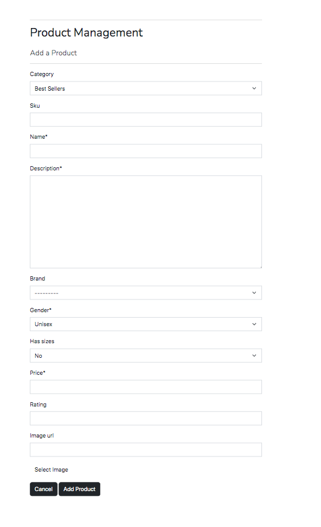|
| Edit Products | This page allows users to edit products using the form with the previously entered data ||
| Delete Products | From the products page, superusers can delete products||


### Review 

Signed in users can leave reviews on specific products. Users can also decide to delete their reviews.


Users can only leave one review per product. 


### 404 Page


A custom 404 page is utilised. Users can click the 'return home' button to return to the home page.

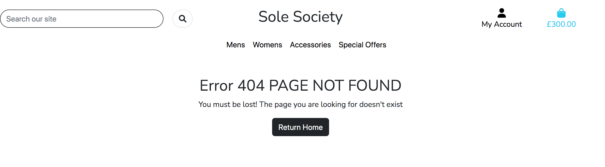

## Technologies Used


### Languages 
* HTML5
* CSS3
* JavaScript
* Python

### Libraries and Frameworks
* Django - web framework.

* Bootstrap 5 -  used for the styling and responsiveness of the site. 

* Google Fonts - used for fonts across the site

* Font - Awesome  used across the website to add icons.

* jQuery - used to simplify HTML and DOM manipulation.

### Packages 

* Django Allauth 

* Django Crispy Forms

* Django Countries

* Pillow.

* Gunicorn.


### Database 

* SQLite.

* Heroku Postgres database.


### Tools, storage & services

* Amazon Web Service - used to store static files and media.

* Stripe - Used to handle and process online payment.

* GitPod

* Github

* Heroku - Deployed site was hosted.

* W3C Markup and Jigsaw validation - used to test and validate the HTML and CSS.

* PEP8 - for validating the python code.

* JSHINT - for validating the javasctipy code.

## Testing 

[Testing](TESTING.md)


## Bugs

When validating pages through lighthouse, the robots txt file was shown as not valid. 
In order to solve this bug, a copy of the robots.txt file was copied into the templates folder.
Then in the main urls.py I added: 
file path("robots.txt",TemplateView.as_view(template_name="./robots.txt", content_type="text/plain")), was added. This solved the bug and allowed the robots file to be crawled. 
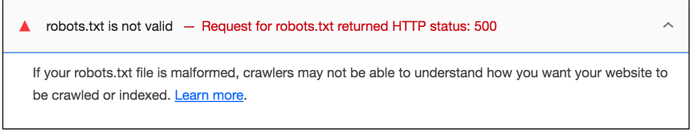


When setting up the payment webhook, the payments failed. This was due to the wh secret key not connecting. Once connected correctly, the webhook succeeded. 
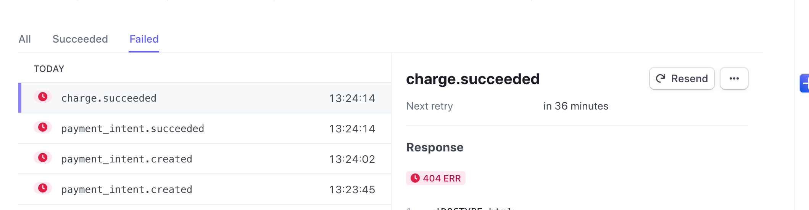

## Deployment

Gitpod workspace was used to develop this project, utilising the code institute template. Using the terminal The project was committed and pushed to github.

### Forking The Repository

Forking a repository of this github project will allow a copy of the original repository to be made and any changes to the copy will not affect the original.
To fork a repository:
* Access the GitHub account and find the  repository.
* On the top right of the page click 'fork'. 
* A copy of the repository will be found in in your GitHub account. 

### Cloning The Repository

Cloning a repository downloads an existing Git repository to your local computer. 
In order to do this: 

* Whilst on github, go to the desired github repository.
* Under the repository name click Clone. 
* To clone the repository using HTTPS, under "Clone with HTTPS", copy the link.
* Open Git Bash.
* Access the directory you want the clone to be made.
* Type git clone, and then paste and enter the URL you copied.
    $ git clone https://github.com/YOUR-USERNAME/YOUR-REPOSITORY

* The  local clone will be created.


### Heroku 

Heroku Deployment

*   In Heroku, create a new app
*   Created a unique name and location for the app
*   On the resources tab, provision a new Heroku Postgres database
*   In the settings tab, go to the Config Vars sections and select reveal config vars 
*   *Configure variables  in Heroku
*	In the gitpod workspace, install dj_database_url and psycopg2 using pip3 install
    dj_database_url & pip3 install psycopg2-binary
*   Ensure Heroku installs the apps requirements by using the pip3 freeze > requirements.txt command 
*   In settings.py import dj_database_url
*   Still in settings.py remove the default database and replace with : 
``` 
        DATABASES = {
        'default': dj_database_url.parse('YOUR_DATABASE_URL_FROM_HEROKU')
        }
```
*   Migrate changes with python3 manage.py migrate
*   As this is a new database, the data needs adding to the new database, do this by using the
    command "./manage.py loaddata db.json" in the terminal.
*   Create a new SuperUser for the Postgres database
*   In settings.py remove the datebase and replace with an if statement so that it connects 
    postgres in Heroku and sqlite in version control 
*   if 'DATABASE_URL' in os.environ:
```
        DATABASES = {
        'default': dj_database_url.parse(os.environ.get('DATABASE_URL'))
    }
        else:
        DATABASES = {
                'default': {
                'ENGINE': 'django.db.backends.sqlite3',
                'NAME': BASE_DIR / 'db.sqlite3',
        }
    }
```


*   Create Procfile so that Heroku creates a web dyno so that it will run gunicorn and serve the        Django app. Use freeze > requirements.txt to add this to the requirements. 

*   Inside the Procfile add web: gunicorn shoes_and_more.wsgi:application
*   Disable Heroku collect static
*   Add the Heroku hostname to allowed hosts in settings.py
*   Produce a new Django secret key and add this to the Heroku config variables
*   Set debug to be true only if there's a variable called development in the environment.
*   Add and commit changes, then push to github and Heroku
*   In the deploy tab in Heroku connect the app to Github by clicking Github and search for the     project’s repository. Once found, click  Enable Automatic Deploys to ensure project is automatically deployed to Heroku as well as github each time it’s pushed
*   In settings.py and ensure the secret key is called from the enviroment using SECRET_KEY = os.environ.get('SECRET_KEY', '')
*   In settings.py set DEBUG = 'DEVELOPMENT' in os.environ


### Amazon Web Service

AWS was used in order to store static and media files. 

* On the amazon web service site, create a new account or log in

* Once logged in, navagate to the AWS Managment Console. 

* Create New Bucket using Create Bucket button 

* Create a new name for the bucket 
 
* Object ownership: ACLs enabled, Bucket owner preffered

* In Block Public Access settings: Uncheck to allow public access
* Acknowledge that the current settings will result that the objects within the bucket will become public

* Click Create Bucket

* In the properties section of the newly created bucket click edit and enable. 
* Hosting type: choose Host a Static Website
* Index document: index.html
* Error document: error.html
* Save the changes made.


* On the permissions tab, navagate to the CORS section and input the following code:
```
[
  {
      "AllowedHeaders": [
          "Authorization"
      ],
      "AllowedMethods": [
          "GET"
      ],
      "AllowedOrigins": [
          "*"
      ],
      "ExposeHeaders": []
  }
]
```

* On the buckets policy, still within the permissions tab, Select Type of Policy: choose S3 Bucket Policy. Then, Effect: choose Allow Principal: *, Actions: select GetObject, 
Complete the (ARN), from the Bucket ARN back in the Bucket Policy. Click Add statement Than Click Generate Policy and copy the policy into bucket policy editor. 

* Add a slash star on to the end of the resource key to allow access to all resources  the bucket then save. 

* In the Access Control List, clock on Everyone (public access), and check List box accept the warning and then save. 

* With the bucket now created navagate to the Identity and Access Management (IAM) through the AWS Management Console. 

* Create a group for our user to live in and name the group. 

* Click Create Policy

* Select import managed policy, then import the AmazonS3FullAccess policy.

* Copy the ARN into the JSON editor. 

* Click on review (appears after tags)

* Add a policy name and description - then click Create Policy. 

* Attach policy to the created group. 

* Download the csv file which is created. 

* In the terminal install Boto3 and Django-storages

* Freeze requirements.txt file

* Add storages to the Installed Apps in settings.py.

* In settings.py add 
if 'USE_AWS' in os.environ:
```
    # Cache control
    AWS_S3_OBJECT_PARAMETERS = {
        'Expires': 'Thu, 31 Dec 2099 20:00:00 GMT',
        'CacheControl': 'max-age=94608000',
    }

    # Bucket Config
    AWS_STORAGE_BUCKET_NAME = 'sole-society'
    AWS_S3_REGION_NAME = 'eu-west-2'
    AWS_ACCESS_KEY_ID = os.environ.get('AWS_ACCESS_KEY_ID')
    AWS_SECRET_ACCESS_KEY = os.environ.get('AWS_SECRET_ACCESS_KEY')
    AWS_S3_CUSTOM_DOMAIN = f'{AWS_STORAGE_BUCKET_NAME}.s3.amazonaws.com'

    # Static and media files
    STATICFILES_STORAGE = 'custom_storages.StaticStorage'
    STATICFILES_LOCATION = 'static'
    DEFAULT_FILE_STORAGE = 'custom_storages.MediaStorage'
    MEDIAFILES_LOCATION = 'media'

    # Override static and media URLs in production
    STATIC_URL = f'https://{AWS_S3_CUSTOM_DOMAIN}/{STATICFILES_LOCATION}/'
    MEDIA_URL = f'https://{AWS_S3_CUSTOM_DOMAIN}/{MEDIAFILES_LOCATION}/'
```

* In Heroku set the config variables using the variables from the csv file. 

* Remove DISABLE_COLLECTSTATIC from Heroku config variables. 

* In the project file root directory, create a file called custom_storages.py 

* Inside add: 
from django.conf import settings
from storages.backends.s3boto3 import S3Boto3Storage
```

    class StaticStorage(S3Boto3Storage):
    location = settings.STATICFILES_LOCATION


    class MediaStorage(S3Boto3Storage):
    location = settings.MEDIAFILES_LOCATION
```
* Back in AWS create a folder named 'media'.

* Upload media to this folder. 

* This is where project files will be hosted. 


## Finished Product

| Page        | Desktop  | Mobile version  |
| ------------- |:-------------:| -----:|
| Home Page | ||
| Footer | ||
| All Products |   |   |
| Product Details | |  |
| Product Review | |  |
| Shopping Bag |  |  |
| Checkout |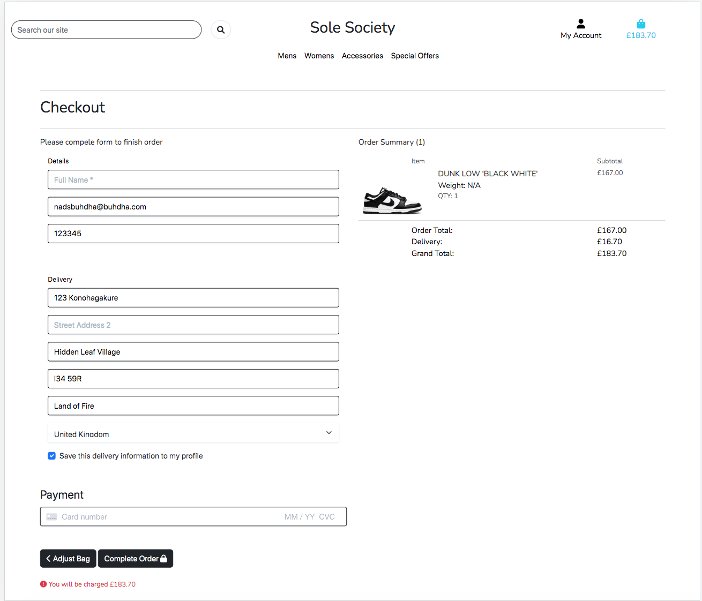 |  |
| Order Summary | 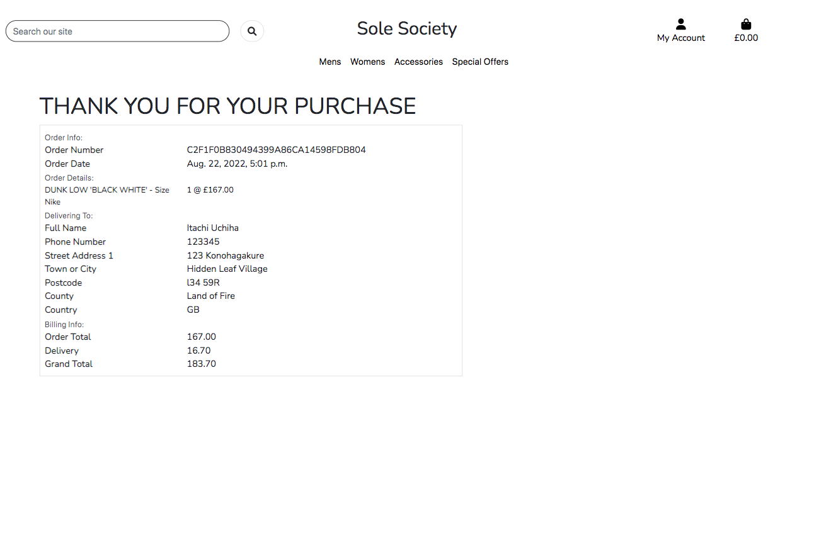 |  | 
| Sign In |  | 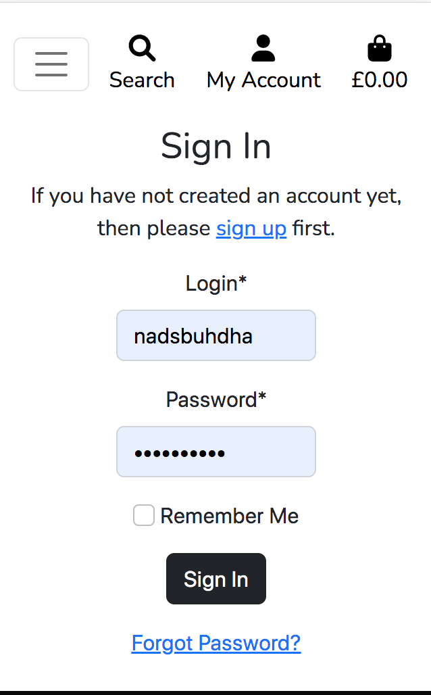 |
| Sign Up |   | |
|Sign Out |  | |
| User Profile |  |  |
| User Favourites |  |  |
| Product Management | |   |


## Credits 
* The Code Institute's Boutique Ado project was used as the main reference point for this project. 
* The product descriptions and images came from https://www.flightclub.com/
* The carousel images came from https://www.pexels.com/ 
* To build the favourite section this tutorial was used https://www.youtube.com/watch?v=OgA0TTKAtqQ&t=1829s
