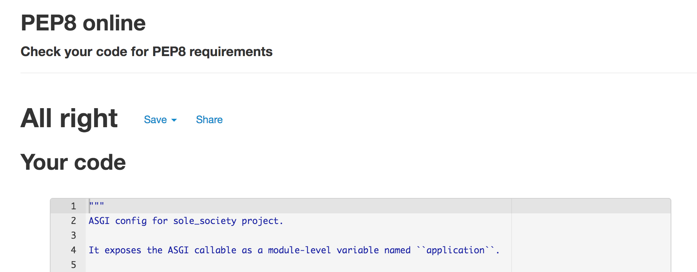
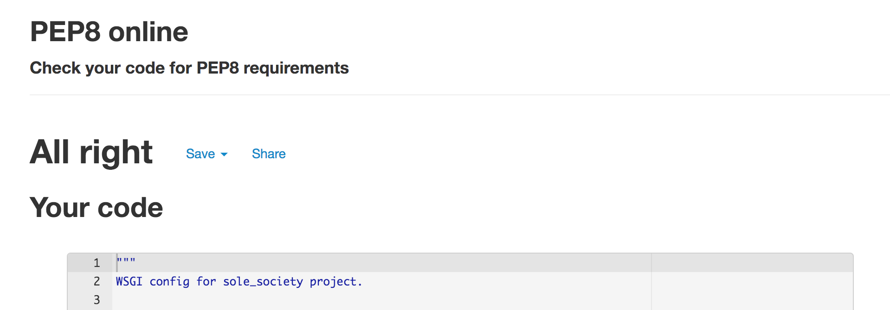

The site has been thoroughly tested throughout

#### Navagation
| Feature       | Test          | Outcome |
| ------------- |:-------------:| -----:|
| Logo          | Does the logo link back to the homepage ? | PASS |
| Search bar    | Does the search bar filter products by what the user has searched? | PASS |
| 'Mens'    | Does the navagation link to the relevant pages seleced on the 'mens' navagation button, displaying only men or unisex footwear ? | PASS |
| 'Womens'     | Does the navagation link to the relevant pages seleced on the 'womens' navagation button, displaying only womens or unisex footwear ? | PASS |
| 'Accessories'     | Does the navagation link to the accessories page ? | PASS |
| 'Speical offers'     | Does the navagation link to the special offers page ? | PASS |
| 'Log In'    | Does the Log in link direct users to Log In page? Does the Log In link only appear when users are logged out ? | PASS |
| 'Sign Up'    | Does the Sign Up link direct users to Register page? Does the Sign Up only appear when users are logged out ?  | PASS |
| 'Sign Out'    | Does the Sign Out link direct users to Sign Out? Does the Sign Out link only appear when users are logged in ?  | PASS |
| 'My Profile'    | Does the My Profile link direct users to My Profile page? Does the My Profile link only appear when users are logged in ?  | PASS |
| 'Product Management'    | Does the Product Management link direct users to Product Management page? Does the Product Management link only appear when super users are logged in ?  | PASS |
| 'BAG'   | Does the bag update the current bag price and display it to the user ? Does the 'Bag' link user to the 'Bag' page ? | PASS |

### Messaging 

| Feature       | Test          | Outcome |
| ------------- |:-------------:| -----:|
| Messaging          | Is there messaging across the site for user activity? | Pass |
| Bag messaging          | When a user adds an item to the bag, is the user informed? | Pass |
| Bag messaging          | When an item is added to the bag, can the user see the previous items added to bag ? | PASS |
| Bag navagation      | When an item is added to the bag, can the user clink the link to go straight to the checkout? | PASS |

### Footer 

| Feature       | Test          | Outcome |
| ------------- |:-------------:| -----:|
| Social Media links      | Does the icons highlight in size when hovered over? Does the icon open in a new browser page when clicked on ? | PASS |
| Newsletter Subscribe     | Can the user sign up to the newsletter with their email ? Are the users informed when they sign up to the newsletter ? | PASS |
| Newsletter Unsubscribe     | Can the user unsubscribe to the newsletter ? Are users redirected to a unsubscribe page ? Once unsubscribed are users redirected home ? Are users notified that they've unsubscribed ? | PASS |

### Homepage
| Feature       | Test          | Outcome |
| ------------- |:-------------:| -----:|
| Carousel      | Does the carousel display three different images relevant to the site? Can users click on carousel buttons to navagate to the products? | PASS |
| Responsiveness      | Are all the elements on the homepage responsive, displaying coherently on desktop, tablet and mobile views? | PASS |

### Products Page 

| Feature       | Test          | Outcome |
| ------------- |:-------------:| -----:|
| Product Navigation Bar  | Does the navagation relocate user to the correct filtered product page? | PASS |
| Product sort  | Are products sorted by the specific category user selects ? | PASS |
| Product display | Are product cards displayed with: product name, product image, product price, product brand ?| PASS |
| Favourite buttons | If the user is authenticated, can the user add the product to their favourites ? If the user is not logged in is the user unable to favourite and redirected to the sign in page ? | PASS |
| Edit / Delete buttons | If the user is a super user, are the edit and delete buttons displayed ? | PASS |
| Responsiveness      | Are all the elements on the products page responsive, displaying coherently on desktop, tablet and mobile views? | PASS |

### Product Details Page 

| Feature       | Test          | Outcome |
| ------------- |:-------------:| -----:|
| Product Details display  | Does Product detail page display: product image, price, brand, name, rating and description ?| PASS |
| Quantity & Size selectors   | Can users select sizes and quantity of the particular product they have selected ? | PASS |
| Favourite buttons | If the user is authenticated, can the user add the product to their favourites ? If the user is not logged in is the user unable to favourite and redirected to the sign in page ? | PASS |
| Edit / Delete buttons | If the user is a super user, are the edit and delete buttons displayed ? | PASS |
| Read Reviews   | Can users any users read review ? | PASS |
| Write & Delete Reviews   | Can users write and delete reviews?  Are reviews limited to one per product? | PASS |
| Responsiveness  | Are all the elements on the product details page responsive, displaying coherently on desktop, tablet and mobile views? | PASS |

### Shopping Bag 
| Feature       | Test          | Outcome |
| ------------- |:-------------:| -----:|
| Shopping bag  display  | Are all the items in the users shopping bag displayed ? | PASS |
| Item Remove  | Can users remove items from the shopping bag ? | PASS |
| Quantity Selector   | Can users update the quantity of their product from the bag ? | PASS |
| Buttons    | Keep shopping and secture checkout buttons navagate to the correct page | PASS |
| Responsiveness  | Are all the elements on the bag page responsive, displaying coherently on desktop, tablet and mobile views? | PASS |

### Checkout Page
| Feature       | Test          | Outcome |
| ------------- |:-------------:| -----:|
| Order Summary   | Is a summary of users items in bag displayed ? | PASS |
| Checkout Form  | Can users complete the checkout form to successfully complete an order ? | PASS |
| Checkout Form logged in   | If an authenticated user has already input their details in the 'my profile' section are these details automatically applied to the form ? | PASS |
| Buttons    | Keep shopping and secture checkout buttons navagate to the correct page | PASS |
| Loading Wheel    | Whilst payment is pending, is a loading wheel displayed to user ?| PASS |
| Responsiveness  | Are all the elements on the checkout page responsive, displaying coherently on desktop, tablet and mobile views? | PASS | 

### Checkout Success
| Feature       | Test          | Outcome |
| ------------- |:-------------:| -----:|
| Purchase Summary | Is the users purcahse summary displayed ? | PASS |
| Responsiveness  | Are all the elements on the product details page responsive, displaying coherently on desktop, tablet and mobile views? | PASS | 

### My Profile Page

| Feature       | Test          | Outcome |
| ------------- |:-------------:| -----:|
| My details form | Can users save their delivery and details from the 'My Profile' | PASS |
| Order History | Can users view a history of their previous orders ? | PASS |
| Favourites | Can users view the products they have saved into their favourites ? | PASS |
| Responsiveness  | Are all the elements on the product details page responsive, displaying coherently on desktop, tablet and mobile views? | PASS | 

### Product Management Page (Add Product)

| Feature       | Test          | Outcome |
| ------------- |:-------------:| -----:|
| Add product form | Can superuser add a product to the site using the add product form ? Does the image upload ? If no image is uploaded, does a default image load ? | PASS |
| Accessibility  | Is the add product page only available to superusers ? | PASS |
| Responsiveness  | Are all the elements on the product details page responsive, displaying coherently on desktop, tablet and mobile views? | PASS | 

### Product Management Page (Edit Product)

| Feature       | Test          | Outcome |
| ------------- |:-------------:| -----:|
| Edit product form | Can superuser edit a product to the site using the edit product form ? Does the image upload ? If no image is uploaded, does a default image load ? | PASS |
| Accessibility  | Is the add product page only available to superusers ? | PASS |
| Responsiveness  | Are all the elements on the product details page responsive, displaying coherently on desktop, tablet and mobile views? | PASS | 

### Validation 

W3C Validator was used to check for error within my HTML code.

The final check presented error free HTML

#### Home Page

#### All Products 

#### Product Details 

#### Checkout  

#### Checkout Success 

#### My Profile 

#### Sign In 

#### Sign Out 

#### Register 

### validation errors 

Due to the nature of django and the use of 'includes' errors were shown on specific pages.
These errors have no impact on the overall website and are also within the bouqiue ado project. 

#### Bag Page

### CSS Validation 

base.css validation

checkout.css validation

profile.css validation

### Python Testing 

asgi validation 

bagg app validation

bagg app context validation

bag app urls validation

bag app views validation

checkout admin validation

checkout app validation 

checkout forms validation

checkout models validation

checkout signals

checkout urls validation 

checkout views validation

checkout webhook handler validation

checkout webhook validation

custom storages validation

home page admin validation

home page app validation

home page forms validation

home page model validation

home page urls validation

home page views validation

main urls validation

manage py validation

product models validation

product urls validation

product admin validation

product app validation

product form validation

product views validation

product widgets validation

profile form validation

profile models validation

profile views validation

profile admin validation

profile app validation

profile urls validation

profile wisgi validation
